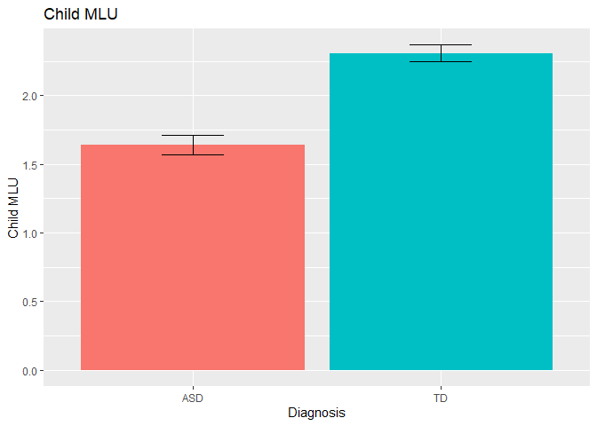

Assignment 2 - Language Development in ASD - Explaining development
================
Bianka, Ruta, Peter & Bella
\[10/10/2019\]

Assignment 2
============

In this assignment you will have to discuss a few important questions (given the data you have). More details below. The assignment submitted to the teachers consists of: - a report answering and discussing the questions (so we can assess your conceptual understanding and ability to explain and critically reflect) - a link to a git repository with all the code (so we can assess your code)

Part 1 - Basic description of language development - Describe your sample (n, age, gender, clinical and cognitive features of the two groups) and critically assess whether the groups (ASD and TD) are balanced - Describe linguistic development (in terms of MLU over time) in TD and ASD children (as a function of group). - Describe how parental use of language (in terms of MLU) changes over time. What do you think is going on? - Include individual differences in your model of language development (in children). Identify the best model.

Part 2 - Model comparison - Discuss the differences in performance of your model in training and testing data - Which individual differences should be included in a model that maximizes your ability to explain/predict new data? - Predict a new kid's performance (Bernie) and discuss it against expected performance of the two groups

Part 3 - Simulations to plan a new study - Report and discuss a power analyses identifying how many new kids you would need to replicate the results

The following involves only Part 1.

Learning objectives
-------------------

-   Summarize and report data and models
-   Critically apply mixed effects (or multilevel) models
-   Explore the issues involved in feature selection

Quick recap
===========

Autism Spectrum Disorder is often related to language impairment. However, this phenomenon has not been empirically traced in detail: i) relying on actual naturalistic language production, ii) over extended periods of time.

We therefore videotaped circa 30 kids with ASD and circa 30 comparison kids (matched by linguistic performance at visit 1) for ca. 30 minutes of naturalistic interactions with a parent. We repeated the data collection 6 times per kid, with 4 months between each visit. We transcribed the data and counted: i) the amount of words that each kid uses in each video. Same for the parent. ii) the amount of unique words that each kid uses in each video. Same for the parent. iii) the amount of morphemes per utterance (Mean Length of Utterance) displayed by each child in each video. Same for the parent.

This data is in the file you prepared in the previous class.

NB. A few children have been excluded from your datasets. We will be using them next week to evaluate how good your models are in assessing the linguistic development in new participants.

This RMarkdown file includes 1) questions (see above). Questions have to be answered/discussed in a separate document that you have to directly send to the teachers. 2) A break down of the questions into a guided template full of hints for writing the code to solve the exercises. Fill in the code and the paragraphs as required. Then report your results in the doc for the teachers.

REMEMBER that you will have to have a github repository for the code and send the answers to Kenneth and Riccardo without code (but a link to your github/gitlab repository). This way we can check your code, but you are also forced to figure out how to report your analyses :-)

Before we get going, here is a reminder of the issues you will have to discuss in your report:

1- Describe your sample (n, age, gender, clinical and cognitive features of the two groups) and critically assess whether the groups (ASD and TD) are balanced 2- Describe linguistic development (in terms of MLU over time) in TD and ASD children (as a function of group). 3- Describe how parental use of language (in terms of MLU) changes over time. What do you think is going on? 4- Include individual differences in your model of language development (in children). Identify the best model.

Let's go
========

### Loading the relevant libraries

Load necessary libraries : what will you need? - e.g. something to deal with the data - e.g. mixed effects models - e.g. something to plot with

### Define your working directory and load the data

If you created a project for this class and opened this Rmd file from within that project, your working directory is your project directory.

If you opened this Rmd file outside of a project, you will need some code to find the data: - Create a new variable called locpath (localpath) - Set it to be equal to your working directory - Move to that directory (setwd(locpath)) - Load the data you saved last time (use read\_csv(fileName))

¤¤¤¤¤¤¤¤¤¤¤¤¤¤¤¤¤¤¤¤¤¤¤¤¤¤¤¤¤¤¤¤¤¤¤¤¤¤¤¤¤¤¤¤¤¤¤¤¤ PART 1 ¤¤¤¤¤¤¤¤¤¤¤¤¤¤¤¤¤¤¤¤¤¤¤¤¤¤¤¤¤¤¤¤¤¤¤¤¤¤¤¤¤¤¤¤¤¤¤¤¤

### Characterize the participants (Exercise 1)

Identify relevant variables: participants demographic characteristics, diagnosis, ADOS, Verbal IQ, Non Verbal IQ, Socialization, Visit, Number of words used, Number of unique words used, mean length of utterance in both child and parents.

Make sure the variables are in the right format.

Describe the characteristics of the two groups of participants and whether the two groups are well matched.

``` r
# summarizing the experimental data in order to compare the two groups, TD and ASD
summary(data)
```

    ##        ID            VISIT                  Ethnicity   Diagnosis Gender 
    ##  Min.   : 1.00   Min.   :1.000   White           :305   ASD:166   F:295  
    ##  1st Qu.:16.00   1st Qu.:2.000   African American: 12   TD :186   M: 57  
    ##  Median :31.00   Median :3.000   White/Latino    : 12                    
    ##  Mean   :30.95   Mean   :3.452   Asian           :  6                    
    ##  3rd Qu.:46.00   3rd Qu.:5.000   White/Asian     :  6                    
    ##  Max.   :61.00   Max.   :6.000   Bangladeshi     :  5                    
    ##                                  (Other)         :  6                    
    ##       Age          MullenRaw     ExpressiveLangRaw      ADOS       
    ##  Min.   :18.30   Min.   :13.00   Min.   : 8.00     Min.   : 0.000  
    ##  1st Qu.:28.55   1st Qu.:27.00   1st Qu.:16.00     1st Qu.: 0.000  
    ##  Median :35.91   Median :33.00   Median :22.00     Median : 5.000  
    ##  Mean   :36.52   Mean   :34.71   Mean   :25.93     Mean   : 7.162  
    ##  3rd Qu.:42.99   3rd Qu.:43.00   3rd Qu.:36.00     3rd Qu.:14.000  
    ##  Max.   :62.40   Max.   :50.00   Max.   :50.00     Max.   :25.000  
    ##  NA's   :6       NA's   :178     NA's   :236       NA's   :235     
    ##  Socialization      types_MOT       types_CHI       tokens_MOT  
    ##  Min.   : 38.00   Min.   : 74.0   Min.   :  0.0   Min.   : 209  
    ##  1st Qu.: 75.00   1st Qu.:298.0   1st Qu.: 29.0   1st Qu.:1441  
    ##  Median : 94.00   Median :352.5   Median :100.0   Median :1839  
    ##  Mean   : 90.23   Mean   :354.5   Mean   :104.7   Mean   :1832  
    ##  3rd Qu.:103.00   3rd Qu.:410.0   3rd Qu.:163.2   3rd Qu.:2260  
    ##  Max.   :125.00   Max.   :601.0   Max.   :307.0   Max.   :3182  
    ##  NA's   :2                                                      
    ##    tokens_CHI        MOT_MLU         CHI_MLU          ADOS1       
    ##  Min.   :   0.0   Min.   :1.856   Min.   :0.000   Min.   : 0.000  
    ##  1st Qu.: 138.5   1st Qu.:3.513   1st Qu.:1.204   1st Qu.: 0.000  
    ##  Median : 353.0   Median :3.971   Median :1.857   Median : 4.500  
    ##  Mean   : 389.8   Mean   :3.918   Mean   :1.993   Mean   : 7.136  
    ##  3rd Qu.: 586.5   3rd Qu.:4.300   3rd Qu.:2.758   3rd Qu.:14.000  
    ##  Max.   :1294.0   Max.   :5.744   Max.   :4.365   Max.   :21.000  
    ##                                                                   
    ##    MullenRaw1    ExpressiveLangRaw1 Socialization1  
    ##  Min.   :13.00   Min.   : 8.00      Min.   : 64.00  
    ##  1st Qu.:24.00   1st Qu.:14.00      1st Qu.: 76.75  
    ##  Median :27.00   Median :18.00      Median : 90.00  
    ##  Mean   :26.37   Mean   :18.84      Mean   : 89.43  
    ##  3rd Qu.:29.00   3rd Qu.:22.00      3rd Qu.:102.00  
    ##  Max.   :42.00   Max.   :33.00      Max.   :115.00  
    ## 

``` r
# The sample included 29 children who are normally depeloping (TD; Mean age = 20.3 months, F=26, M=6) and 32 children with autism disorder (ASD; Mean age = 32.9, F=25, M=4)

# creating barcharts to visualize how gender and ethnicity is distributed between the ASD and TD participant group
# gender
barchartGender <- ggplot(data, aes(Diagnosis, Gender, fill = Gender)) + geom_bar(stat = "identity") + guides(fill = guide_legend(reverse = TRUE)) + labs(fill = "Gender") + ggtitle("Gender Distribution")
barchartGender
```


``` r
# ethnicity
barchartEthnicity <- ggplot(data, aes(Diagnosis, Ethnicity, fill = Ethnicity)) + geom_bar(stat = "identity") + guides(fill = guide_legend(reverse = TRUE)) + labs(fill = "Ethnicity") + ggtitle("Ethnic Distribution")
barchartEthnicity
```


``` r
# creating boxplots to visualize the ADOS score, socialization score, verbal IQ, non-verbal IQ, number of words and unique words, and mean length of utterance for child and parent between TD and ASD diagnostic groups
# ADOS
boxplot_ADOS <- ggplot(data, aes(Diagnosis,ADOS,fill=Diagnosis))+geom_boxplot()+labs(title = "ADOS",x = "Diagnosis", y = "ADOS score") + scale_fill_manual(values = wes_palette("GrandBudapest2"))
boxplot_ADOS
```

    ## Warning: Removed 235 rows containing non-finite values (stat_boxplot).


``` r
# socilization
boxplotSocialization<- ggplot(data, aes(x=Diagnosis, y=Socialization, fill = Diagnosis))+geom_boxplot()+labs(title = "Socialization", x = "Diagnosis", y = "Socialization score")+scale_fill_manual(values = wes_palette("GrandBudapest1"))
boxplotSocialization
```

    ## Warning: Removed 2 rows containing non-finite values (stat_boxplot).


``` r
# verbal IQ in all
boxplotVerbal_IQ<- ggplot(data, aes(x=Diagnosis, y=ExpressiveLangRaw, fill = Diagnosis))+geom_boxplot()+labs(title = "Verbal IQ", x = "Diagnosis", y = "Verbal IQ")+scale_fill_manual(values = wes_palette("GrandBudapest2"))
boxplotVerbal_IQ
```

    ## Warning: Removed 236 rows containing non-finite values (stat_boxplot).


``` r
boxplotVerbal_IQ_day_1<- ggplot(data, aes(x=Diagnosis, y=ExpressiveLangRaw1, fill = Diagnosis))+geom_boxplot()+labs(title = "Verbal IQ day 1", x = "Diagnosis", y = "Verbal IQ at day 1")+scale_fill_manual(values = wes_palette("GrandBudapest2"))
boxplotVerbal_IQ_day_1
```


``` r
# nonverbal IQ at visit 1
boxplotNonverbal_IQ<- ggplot(data, aes(x=Diagnosis, y=MullenRaw, fill = Diagnosis))+geom_boxplot()+labs(title = "Nonverbal IQ", x = "Diagnosis", y = "Non-verbal IQ")+scale_fill_manual(values = wes_palette("GrandBudapest1"))
boxplotNonverbal_IQ
```

    ## Warning: Removed 178 rows containing non-finite values (stat_boxplot).


``` r
# child unique words
boxplotWordTypes<- ggplot(data, aes(x=Diagnosis, y=types_CHI, fill = Diagnosis))+geom_boxplot()+labs(title = "Number of unique words used by child", x = "Diagnosis", y = "Number of unique words used by child")+scale_fill_manual(values = wes_palette("GrandBudapest2"))
boxplotWordTypes
```


``` r
# child word count
boxplotWordCount <- ggplot(data, aes(Diagnosis, tokens_CHI, fill = Diagnosis)) + geom_boxplot() + labs(title = "Number of words used by child",x = "Diagnosis", y = "Number of words used by child")+scale_fill_manual(values = wes_palette("GrandBudapest1"))
boxplotWordCount
```


``` r
# creating a boxplot that dispalys individual children's MLU's and diagnostic group
boxplotChild_MLU <- ggplot(data, aes(Diagnosis, CHI_MLU, fill = Diagnosis)) + geom_boxplot() + labs(title = "Child mean length of utterance", x = "Diagnosis", y = "Child mean length of utterance")+scale_fill_manual(values = wes_palette("GrandBudapest1"))
boxplotChild_MLU
```


``` r
# creating a boxplot that visualizes the distribution of the parents' MLU's between diagnostic groups
boxplotMother_MLU <- ggplot(data, aes(Diagnosis, MOT_MLU, fill = Diagnosis)) + geom_boxplot() + labs(title = "Parent mean length of utterance", x = "Diagnosis", y = "Parent mean length of utterance")+scale_fill_manual(values = wes_palette("GrandBudapest2"))
boxplotMother_MLU
```


``` r
# creating a boxplot that visualizes individual parents' MLU's grouped by diagnosis
data$ID <- as.factor(data$ID)
boxplotMother_MLU_2 <- ggplot(data, aes(ID, MOT_MLU, fill = Diagnosis)) + geom_boxplot() + labs(title = "Parent mean length of utterance", x = "Child diagnosis", y = "Parent mean length of utterance")+scale_fill_manual(values = wes_palette("GrandBudapest1"))
boxplotMother_MLU_2
```


``` r
# creating a boxplot that visualizes individual children's MLU's grouped by diagnosis
boxplotChild_MLU_2 <- ggplot(data, aes(ID, CHI_MLU, fill = Diagnosis)) + geom_boxplot() + labs(title = "Child mean length of utterance", x = " Diagnosis", y = "Parent mean length of utterance")+scale_fill_manual(values = wes_palette("GrandBudapest2"))
boxplotChild_MLU_2
```


Let's test hypothesis 1: Children with ASD display a language impairment (Exercise 2)
-------------------------------------------------------------------------------------

### Hypothesis: The child's MLU changes: i) over time, ii) according to diagnosis

Let's start with a simple mixed effects linear model

Remember to plot the data first and then to run a statistical test. - Which variable(s) should be included as fixed factors? - Which variable(s) should be included as random factors?

``` r
# creating a barchart visualizing the mean child MLU according to diagnosis
barchartChild_MLU <- ggplot(data, aes(Diagnosis, CHI_MLU, fill = Diagnosis)) + stat_summary(fun.y = mean, geom = "bar") + geom_errorbar(stat = "summary", fun.data = mean_se, width = 0.25) + theme(legend.position='none') + labs(title = "Child MLU", x = "Diagnosis", y = "Child MLU")
barchartChild_MLU
```



``` r
# creating a lineplot visualizing general MLU trajectories of diagnositc groups
lineplot_MLU <- ggplot(data, aes(VISIT, CHI_MLU, color = Diagnosis)) + geom_point() + geom_smooth(method = "lm", se = F) + labs(title = "Child MLU by diagnosis without individual random intercept", x = "Visit number", y = "Child MLU")
lineplot_MLU
```


``` r
# visualizing individual MLU trajectories of the ASD children
# factorizing continuous ID numbers
data$ID <- as.factor(data$ID)
# creating a lineplot  of individual ASD MLU trajectories
lineplot_ASD_MLU <- ggplot(filter(data, Diagnosis == "ASD"), aes(VISIT, CHI_MLU, group = ID, color = ID)) + geom_smooth(method = "lm", se = F) + labs(title = "ASD Child MLU", x = "Visit number", y = "Child MLU")
lineplot_ASD_MLU
```


``` r
# visualizing the individual MLU trajectories of the children grouped by diagnostics
lineplot_ASD_TD_MLU <- ggplot(data, aes(VISIT, CHI_MLU, group = ID, color = Diagnosis)) + geom_smooth(method = "lm", se = F) + labs(title = "Child MLU", x = "Visit number", y = "Child MLU")
lineplot_ASD_TD_MLU
```


``` r
# visualizing the individual MLU trajectories of the parents grouped by diagnostics
lineplotParent_MLU <- ggplot(data, aes(VISIT, MOT_MLU, group = ID, color = Diagnosis)) + geom_smooth(method = "lm", se = F) + labs(title = "Parent MLU", x = "Visit number", y = "Parent MLU")
lineplotParent_MLU
```


``` r
# creating a mixed effects model with random intercept dependent on ID and visit number as predictor
CHI_model_1 <- lmerTest::lmer(CHI_MLU ~ VISIT + (1|ID), data = data, REML = F)
summary(CHI_model_1)
```

    ## Linear mixed model fit by maximum likelihood . t-tests use
    ##   Satterthwaite's method [lmerModLmerTest]
    ## Formula: CHI_MLU ~ VISIT + (1 | ID)
    ##    Data: data
    ## 
    ##      AIC      BIC   logLik deviance df.resid 
    ##    674.3    689.7   -333.1    666.3      348 
    ## 
    ## Scaled residuals: 
    ##      Min       1Q   Median       3Q      Max 
    ## -2.82049 -0.65132 -0.02147  0.58797  2.63518 
    ## 
    ## Random effects:
    ##  Groups   Name        Variance Std.Dev.
    ##  ID       (Intercept) 0.4561   0.6754  
    ##  Residual             0.2554   0.5054  
    ## Number of obs: 352, groups:  ID, 61
    ## 
    ## Fixed effects:
    ##              Estimate Std. Error        df t value Pr(>|t|)    
    ## (Intercept)   1.19829    0.10578 110.27314   11.33   <2e-16 ***
    ## VISIT         0.23027    0.01586 291.46155   14.52   <2e-16 ***
    ## ---
    ## Signif. codes:  0 '***' 0.001 '**' 0.01 '*' 0.05 '.' 0.1 ' ' 1
    ## 
    ## Correlation of Fixed Effects:
    ##       (Intr)
    ## VISIT -0.516

``` r
# creating a mixed effects model with random intercept dependent on ID while visit number and diagnosis are fixed effects
CHI_model_2 <- lmerTest::lmer(CHI_MLU ~ Diagnosis + VISIT + (1|ID), data = data, REML = F)
summary(CHI_model_2) 
```

    ## Linear mixed model fit by maximum likelihood . t-tests use
    ##   Satterthwaite's method [lmerModLmerTest]
    ## Formula: CHI_MLU ~ Diagnosis + VISIT + (1 | ID)
    ##    Data: data
    ## 
    ##      AIC      BIC   logLik deviance df.resid 
    ##    661.7    681.0   -325.8    651.7      347 
    ## 
    ## Scaled residuals: 
    ##      Min       1Q   Median       3Q      Max 
    ## -2.79349 -0.61847  0.00744  0.59360  2.60194 
    ## 
    ## Random effects:
    ##  Groups   Name        Variance Std.Dev.
    ##  ID       (Intercept) 0.3487   0.5905  
    ##  Residual             0.2555   0.5055  
    ## Number of obs: 352, groups:  ID, 61
    ## 
    ## Fixed effects:
    ##              Estimate Std. Error        df t value Pr(>|t|)    
    ## (Intercept)   0.85412    0.12877  89.91066   6.633  2.4e-09 ***
    ## DiagnosisTD   0.65418    0.16079  60.76621   4.068 0.000139 ***
    ## VISIT         0.23045    0.01586 291.36956  14.531  < 2e-16 ***
    ## ---
    ## Signif. codes:  0 '***' 0.001 '**' 0.01 '*' 0.05 '.' 0.1 ' ' 1
    ## 
    ## Correlation of Fixed Effects:
    ##             (Intr) DgnsTD
    ## DiagnosisTD -0.657       
    ## VISIT       -0.426  0.002

``` r
# creating a mixed effects model with random ID intercept and interaction between visit number and diagnosis
CHI_model_3 <- lmerTest::lmer(CHI_MLU ~ Diagnosis*VISIT + (1|ID), data = data, REML = F)
summary(CHI_model_3)
```

    ## Linear mixed model fit by maximum likelihood . t-tests use
    ##   Satterthwaite's method [lmerModLmerTest]
    ## Formula: CHI_MLU ~ Diagnosis * VISIT + (1 | ID)
    ##    Data: data
    ## 
    ##      AIC      BIC   logLik deviance df.resid 
    ##    592.7    615.9   -290.4    580.7      346 
    ## 
    ## Scaled residuals: 
    ##      Min       1Q   Median       3Q      Max 
    ## -2.84583 -0.51097 -0.07827  0.52713  2.55737 
    ## 
    ## Random effects:
    ##  Groups   Name        Variance Std.Dev.
    ##  ID       (Intercept) 0.3581   0.5984  
    ##  Residual             0.2003   0.4475  
    ## Number of obs: 352, groups:  ID, 61
    ## 
    ## Fixed effects:
    ##                    Estimate Std. Error        df t value Pr(>|t|)    
    ## (Intercept)         1.30676    0.13589 109.87517   9.616 3.00e-16 ***
    ## DiagnosisTD        -0.21389    0.18765 109.93169  -1.140    0.257    
    ## VISIT               0.09957    0.02025 291.23497   4.916 1.48e-06 ***
    ## DiagnosisTD:VISIT   0.25188    0.02811 291.28018   8.962  < 2e-16 ***
    ## ---
    ## Signif. codes:  0 '***' 0.001 '**' 0.01 '*' 0.05 '.' 0.1 ' ' 1
    ## 
    ## Correlation of Fixed Effects:
    ##             (Intr) DgnsTD VISIT 
    ## DiagnosisTD -0.724              
    ## VISIT       -0.515  0.373       
    ## DgnTD:VISIT  0.371 -0.516 -0.721

``` r
# creating a mixed effects model with random ID intercept and slope and interaction between visit number and diagnosis
CHI_model_4 <- lmerTest::lmer(CHI_MLU ~ Diagnosis*VISIT + (1|ID) + (0 + VISIT|ID), data = data, REML = F)
summary(CHI_model_4)
```

    ## Linear mixed model fit by maximum likelihood . t-tests use
    ##   Satterthwaite's method [lmerModLmerTest]
    ## Formula: CHI_MLU ~ Diagnosis * VISIT + (1 | ID) + (0 + VISIT | ID)
    ##    Data: data
    ## 
    ##      AIC      BIC   logLik deviance df.resid 
    ##    570.9    598.0   -278.5    556.9      345 
    ## 
    ## Scaled residuals: 
    ##     Min      1Q  Median      3Q     Max 
    ## -2.4770 -0.5409 -0.0899  0.4589  2.7458 
    ## 
    ## Random effects:
    ##  Groups   Name        Variance Std.Dev.
    ##  ID       (Intercept) 0.265128 0.51491 
    ##  ID.1     VISIT       0.009856 0.09928 
    ##  Residual             0.163351 0.40417 
    ## Number of obs: 352, groups:  ID, 61
    ## 
    ## Fixed effects:
    ##                   Estimate Std. Error       df t value Pr(>|t|)    
    ## (Intercept)        1.30385    0.11892 79.68252  10.964  < 2e-16 ***
    ## DiagnosisTD       -0.21529    0.16426 79.83737  -1.311 0.193721    
    ## VISIT              0.10059    0.02601 80.94529   3.868 0.000221 ***
    ## DiagnosisTD:VISIT  0.25277    0.03604 81.67887   7.014 6.11e-10 ***
    ## ---
    ## Signif. codes:  0 '***' 0.001 '**' 0.01 '*' 0.05 '.' 0.1 ' ' 1
    ## 
    ## Correlation of Fixed Effects:
    ##             (Intr) DgnsTD VISIT 
    ## DiagnosisTD -0.724              
    ## VISIT       -0.375  0.272       
    ## DgnTD:VISIT  0.271 -0.377 -0.722

How would you evaluate whether the model is a good model?

``` r
# establishing a null model including random intercepts
CHI_model_0 <- lmerTest::lmer(CHI_MLU ~ (1|ID), data = data, REML = F)

# comparing the model 0 and 1 using anova to investigate the effect of visit in the model
anova(CHI_model_0, CHI_model_1)
```

    ## Data: data
    ## Models:
    ## CHI_model_0: CHI_MLU ~ (1 | ID)
    ## CHI_model_1: CHI_MLU ~ VISIT + (1 | ID)
    ##             Df    AIC    BIC  logLik deviance  Chisq Chi Df Pr(>Chisq)    
    ## CHI_model_0  3 831.02 842.61 -412.51   825.02                             
    ## CHI_model_1  4 674.27 689.73 -333.14   666.27 158.75      1  < 2.2e-16 ***
    ## ---
    ## Signif. codes:  0 '***' 0.001 '**' 0.01 '*' 0.05 '.' 0.1 ' ' 1

``` r
# comparing model 1 and 2 using anova to investigate the effect of diagnosis in the model
anova(CHI_model_1, CHI_model_2)
```

    ## Data: data
    ## Models:
    ## CHI_model_1: CHI_MLU ~ VISIT + (1 | ID)
    ## CHI_model_2: CHI_MLU ~ Diagnosis + VISIT + (1 | ID)
    ##             Df    AIC    BIC  logLik deviance  Chisq Chi Df Pr(>Chisq)    
    ## CHI_model_1  4 674.27 689.73 -333.14   666.27                             
    ## CHI_model_2  5 661.65 680.97 -325.83   651.65 14.622      1  0.0001314 ***
    ## ---
    ## Signif. codes:  0 '***' 0.001 '**' 0.01 '*' 0.05 '.' 0.1 ' ' 1

``` r
# comparing model 2 and 3 using anova to investigate the effect of random slope in the model
anova(CHI_model_2, CHI_model_3)
```

    ## Data: data
    ## Models:
    ## CHI_model_2: CHI_MLU ~ Diagnosis + VISIT + (1 | ID)
    ## CHI_model_3: CHI_MLU ~ Diagnosis * VISIT + (1 | ID)
    ##             Df    AIC    BIC  logLik deviance  Chisq Chi Df Pr(>Chisq)    
    ## CHI_model_2  5 661.65 680.97 -325.83   651.65                             
    ## CHI_model_3  6 592.71 615.89 -290.36   580.71 70.938      1  < 2.2e-16 ***
    ## ---
    ## Signif. codes:  0 '***' 0.001 '**' 0.01 '*' 0.05 '.' 0.1 ' ' 1

``` r
# comparing model 3 and 4 using anova to investigate the effect of random slope in the model
anova(CHI_model_3, CHI_model_4)
```

    ## Data: data
    ## Models:
    ## CHI_model_3: CHI_MLU ~ Diagnosis * VISIT + (1 | ID)
    ## CHI_model_4: CHI_MLU ~ Diagnosis * VISIT + (1 | ID) + (0 + VISIT | ID)
    ##             Df    AIC    BIC  logLik deviance  Chisq Chi Df Pr(>Chisq)    
    ## CHI_model_3  6 592.71 615.89 -290.36   580.71                             
    ## CHI_model_4  7 570.95 598.00 -278.48   556.95 23.762      1   1.09e-06 ***
    ## ---
    ## Signif. codes:  0 '***' 0.001 '**' 0.01 '*' 0.05 '.' 0.1 ' ' 1

``` r
# according to the anova, child model 3 is superior and explains the biggest part of the variance
```

Not too good, right? Let's check whether a growth curve model is better. Remember: a growth curve model assesses whether changes in time can be described by linear, or quadratic, or cubic (or... etc.) components. First build the different models, then compare them to see which one is better.

Exciting right? Let's check whether the model is doing an alright job at fitting the data. Plot the actual CHI\_MLU data against the predictions of the model fitted(model).

Now it's time to report our results. Remember to report: - the estimates for each predictor (beta estimate, standard error, p-value) - A plain word description of the results - A plot of your model's predictions (and some comments on whether the predictions are sensible)

\[REPORT THE RESULTS\] Linguistic development of children MLU is affected by ... \[COMPLETE\]

Let's test hypothesis 2: Parents speak equally to children with ASD and TD (Exercise 3)
---------------------------------------------------------------------------------------

### Hypothesis: Parental MLU changes: i) over time, ii) according to diagnosis

``` r
# creating a mixed effects model of parent MLU with random intercepts based on ID and visit set as a fixed effect
MOT_model_5 <- lmerTest::lmer(MOT_MLU ~ VISIT + (1|ID), data = data, REML = F)
summary(MOT_model_5) 
```

    ## Linear mixed model fit by maximum likelihood . t-tests use
    ##   Satterthwaite's method [lmerModLmerTest]
    ## Formula: MOT_MLU ~ VISIT + (1 | ID)
    ##    Data: data
    ## 
    ##      AIC      BIC   logLik deviance df.resid 
    ##    541.9    557.4   -267.0    533.9      348 
    ## 
    ## Scaled residuals: 
    ##     Min      1Q  Median      3Q     Max 
    ## -2.8595 -0.6393  0.0077  0.6022  3.7665 
    ## 
    ## Random effects:
    ##  Groups   Name        Variance Std.Dev.
    ##  ID       (Intercept) 0.2268   0.4762  
    ##  Residual             0.1861   0.4314  
    ## Number of obs: 352, groups:  ID, 61
    ## 
    ## Fixed effects:
    ##              Estimate Std. Error        df t value Pr(>|t|)    
    ## (Intercept)   3.50796    0.08013 131.84649  43.776  < 2e-16 ***
    ## VISIT         0.11714    0.01353 291.57489   8.656 3.37e-16 ***
    ## ---
    ## Signif. codes:  0 '***' 0.001 '**' 0.01 '*' 0.05 '.' 0.1 ' ' 1
    ## 
    ## Correlation of Fixed Effects:
    ##       (Intr)
    ## VISIT -0.582

``` r
# creating a mixed effects model of parent MLU with random intercept dependent on ID while visit number and diagnosis are fixed effects
MOT_model_6 <- lmerTest::lmer(MOT_MLU ~ Diagnosis + VISIT + (1|ID), data = data, REML = F)
summary(MOT_model_6) 
```

    ## Linear mixed model fit by maximum likelihood . t-tests use
    ##   Satterthwaite's method [lmerModLmerTest]
    ## Formula: MOT_MLU ~ Diagnosis + VISIT + (1 | ID)
    ##    Data: data
    ## 
    ##      AIC      BIC   logLik deviance df.resid 
    ##    527.5    546.8   -258.7    517.5      347 
    ## 
    ## Scaled residuals: 
    ##     Min      1Q  Median      3Q     Max 
    ## -2.8008 -0.6024 -0.0300  0.5843  3.8273 
    ## 
    ## Random effects:
    ##  Groups   Name        Variance Std.Dev.
    ##  ID       (Intercept) 0.1653   0.4066  
    ##  Residual             0.1861   0.4314  
    ## Number of obs: 352, groups:  ID, 61
    ## 
    ## Fixed effects:
    ##              Estimate Std. Error        df t value Pr(>|t|)    
    ## (Intercept)   3.24655    0.09497 104.11777  34.186  < 2e-16 ***
    ## DiagnosisTD   0.49592    0.11403  60.85128   4.349 5.30e-05 ***
    ## VISIT         0.11748    0.01353 291.71920   8.682 2.81e-16 ***
    ## ---
    ## Signif. codes:  0 '***' 0.001 '**' 0.01 '*' 0.05 '.' 0.1 ' ' 1
    ## 
    ## Correlation of Fixed Effects:
    ##             (Intr) DgnsTD
    ## DiagnosisTD -0.632       
    ## VISIT       -0.493  0.003

``` r
# creating a mixed effects model of parent MLU with random ID intercept and interaction between visit number and diagnosis
MOT_model_7 <- lmerTest::lmer(MOT_MLU ~ Diagnosis*VISIT + (1|ID), data = data, REML = F)
summary(MOT_model_7)
```

    ## Linear mixed model fit by maximum likelihood . t-tests use
    ##   Satterthwaite's method [lmerModLmerTest]
    ## Formula: MOT_MLU ~ Diagnosis * VISIT + (1 | ID)
    ##    Data: data
    ## 
    ##      AIC      BIC   logLik deviance df.resid 
    ##    527.5    550.6   -257.7    515.5      346 
    ## 
    ## Scaled residuals: 
    ##     Min      1Q  Median      3Q     Max 
    ## -2.8071 -0.6010 -0.0215  0.5538  3.7259 
    ## 
    ## Random effects:
    ##  Groups   Name        Variance Std.Dev.
    ##  ID       (Intercept) 0.1657   0.4071  
    ##  Residual             0.1848   0.4299  
    ## Number of obs: 352, groups:  ID, 61
    ## 
    ## Fixed effects:
    ##                    Estimate Std. Error        df t value Pr(>|t|)    
    ## (Intercept)         3.31534    0.10657 154.21726  31.109  < 2e-16 ***
    ## DiagnosisTD         0.36394    0.14717 154.31890   2.473   0.0145 *  
    ## VISIT               0.09757    0.01945 291.61382   5.017 9.15e-07 ***
    ## DiagnosisTD:VISIT   0.03831    0.02699 291.69957   1.419   0.1568    
    ## ---
    ## Signif. codes:  0 '***' 0.001 '**' 0.01 '*' 0.05 '.' 0.1 ' ' 1
    ## 
    ## Correlation of Fixed Effects:
    ##             (Intr) DgnsTD VISIT 
    ## DiagnosisTD -0.724              
    ## VISIT       -0.631  0.457       
    ## DgnTD:VISIT  0.455 -0.632 -0.721

``` r
# creating a mixed effects model of parent MLU with random ID intercept and slope and interaction between visit number and diagnosis
MOT_model_8 <- lmerTest::lmer(MOT_MLU ~ Diagnosis*VISIT + (1|ID) + (0 + VISIT|ID), data = data, REML = F)
summary(MOT_model_8)
```

    ## Linear mixed model fit by maximum likelihood . t-tests use
    ##   Satterthwaite's method [lmerModLmerTest]
    ## Formula: MOT_MLU ~ Diagnosis * VISIT + (1 | ID) + (0 + VISIT | ID)
    ##    Data: data
    ## 
    ##      AIC      BIC   logLik deviance df.resid 
    ##    524.3    551.3   -255.1    510.3      345 
    ## 
    ## Scaled residuals: 
    ##     Min      1Q  Median      3Q     Max 
    ## -2.7232 -0.6108 -0.0370  0.5706  3.5349 
    ## 
    ## Random effects:
    ##  Groups   Name        Variance Std.Dev.
    ##  ID       (Intercept) 0.156757 0.39593 
    ##  ID.1     VISIT       0.003224 0.05678 
    ##  Residual             0.168365 0.41032 
    ## Number of obs: 352, groups:  ID, 61
    ## 
    ## Fixed effects:
    ##                    Estimate Std. Error        df t value Pr(>|t|)    
    ## (Intercept)         3.31455    0.10272 117.99354  32.267  < 2e-16 ***
    ## DiagnosisTD         0.36234    0.14188 118.21786   2.554   0.0119 *  
    ## VISIT               0.09800    0.02138 118.60211   4.585 1.13e-05 ***
    ## DiagnosisTD:VISIT   0.03888    0.02965 119.46302   1.311   0.1923    
    ## ---
    ## Signif. codes:  0 '***' 0.001 '**' 0.01 '*' 0.05 '.' 0.1 ' ' 1
    ## 
    ## Correlation of Fixed Effects:
    ##             (Intr) DgnsTD VISIT 
    ## DiagnosisTD -0.724              
    ## VISIT       -0.544  0.394       
    ## DgnTD:VISIT  0.392 -0.545 -0.721

### Adding new variables (Exercise 4)

Your task now is to figure out how to best describe the children linguistic trajectory. The dataset contains a bunch of additional demographic, cognitive and clinical variables (e.g.verbal and non-verbal IQ). Try them out and identify the statistical models that best describes your data (that is, the children's MLU). Describe how you selected the best model and send the code to run the model to Riccardo and Kenneth

¤¤¤¤¤¤¤¤¤¤¤¤¤¤¤¤¤¤¤¤¤¤¤¤¤¤¤¤¤¤¤¤¤¤¤¤¤¤¤¤¤¤¤¤¤¤¤¤¤ PART 2 ¤¤¤¤¤¤¤¤¤¤¤¤¤¤¤¤¤¤¤¤¤¤¤¤¤¤¤¤¤¤¤¤¤¤¤¤¤¤¤¤¤¤¤¤¤¤¤¤¤

Welcome to the second exciting part of the Language Development in ASD exercise
-------------------------------------------------------------------------------

In this exercise we will delve more in depth with different practices of model comparison and model selection, by first evaluating your models from last time against some new data. Does the model generalize well? Then we will learn to do better by cross-validating models and systematically compare them.

The questions to be answered (in a separate document) are: 1- Discuss the differences in performance of your model in training and testing data 2- Which individual differences should be included in a model that maximizes your ability to explain/predict new data? 3- Predict a new kid's performance (Bernie) and discuss it against expected performance of the two groups

Learning objectives
-------------------

-   Critically appraise the predictive framework (contrasted to the explanatory framework)
-   Learn the basics of machine learning workflows: training/testing, cross-validation, feature selections

Let's go
--------

N.B. There are several datasets for this exercise, so pay attention to which one you are using!

1.  The (training) dataset from last time (the awesome one you produced :-) ).
2.  The (test) datasets on which you can test the models from last time:

-   Demographic and clinical data: <https://www.dropbox.com/s/ra99bdvm6fzay3g/demo_test.csv?dl=1>
-   Utterance Length data: <https://www.dropbox.com/s/uxtqqzl18nwxowq/LU_test.csv?dl=1>
-   Word data: <https://www.dropbox.com/s/1ces4hv8kh0stov/token_test.csv?dl=1>

### Exercise 1) Testing model performance

How did your models from last time perform? In this exercise you have to compare the results on the training data () and on the test data. Report both of them. Compare them. Discuss why they are different.

-   recreate the models you chose last time (just write the model code again and apply it to your training data (from the first assignment))
-   calculate performance of the model on the training data: root mean square error is a good measure. (Tip: google the function rmse())
-   create the test dataset (apply the code from assignment 1 to clean up the 3 test datasets)
-   test the performance of the models on the test data (Tips: google the functions "predict()")
-   optional: predictions are never certain, can you identify the uncertainty of the predictions? (e.g. google predictinterval())

``` r
# creating a clean up function that streamlines the datasets into a common format before merging into new dataframe
CleanUpData <- function(Demo,LU,Word){
  
  Speech <- merge(LU, Word) %>% 
    rename(
      Child.ID = SUBJ, 
      Visit=VISIT) %>%
    mutate(
      Visit = as.numeric(str_extract(Visit, "\\d")),
      Child.ID = gsub("\\.","", Child.ID)
      ) %>%
    dplyr::select(
      Child.ID, Visit, MOT_MLU, CHI_MLU, types_MOT, types_CHI, tokens_MOT, tokens_CHI
    )
  
  Demo <- Demo %>%
    dplyr::select(
      Child.ID, Visit, Ethnicity, Diagnosis, Gender, Age, ADOS, MullenRaw, ExpressiveLangRaw, Socialization
    ) %>%
    mutate(
      Child.ID = gsub("\\.","", Child.ID)
    )
    
  Data=merge(Demo,Speech,all=T)
  
  Data1= Data %>% 
     subset(Visit=="1") %>% 
     dplyr::select(Child.ID, ADOS, ExpressiveLangRaw, MullenRaw, Socialization) %>%
     rename(Ados1 = ADOS, 
            verbalIQ1 = ExpressiveLangRaw, 
            nonVerbalIQ1 = MullenRaw,
            Socialization1 = Socialization) 
  
  Data=merge(Data, Data1, all=T) %>%
    mutate(
      Child.ID = as.numeric(as.factor(as.character(Child.ID))),
      Visit = as.numeric(as.character(Visit)),
      Gender = recode(Gender, 
         "1" = "M",
         "2" = "F"),
      Diagnosis = recode(Diagnosis,
         "A"  = "ASD",
         "B"  = "TD")
    )
  return(Data)
}

# loading training datasets from csv files to dataframes
train_LU <- read.csv("LU_train.csv")
trainDemo <- read.csv("demo_train.csv")
trainToken <- read.csv("token_train.csv")

# loading testing datasets from csv files to dataframes
testDemo <- read.csv("demo_test.csv")
test_LU <- read.csv("LU_test.csv")
testToken <- read.csv("token_test.csv")

# running clean up function on the datasets
cleanTrainData <- CleanUpData(trainDemo, train_LU, trainToken)
cleanTestData <- CleanUpData(testDemo, test_LU, testToken)

# excluding NA's from the cleaned datasets
cleanTrain <- subset(cleanTrainData, !is.na(CHI_MLU))
cleanTest <- subset(cleanTestData,!is.na(CHI_MLU))

# recreating the model, we selected as the best fitting (expModel_1) and applying it to the train dataset
bestModel <- lmer(CHI_MLU ~ Visit * Diagnosis * verbalIQ1 + (1|Child.ID) + (0 + Visit|Child.ID), data = cleanTrain)
summary(bestModel)
```

    ## Linear mixed model fit by REML. t-tests use Satterthwaite's method [
    ## lmerModLmerTest]
    ## Formula: CHI_MLU ~ Visit * Diagnosis * verbalIQ1 + (1 | Child.ID) + (0 +  
    ##     Visit | Child.ID)
    ##    Data: cleanTrain
    ## 
    ## REML criterion at convergence: 531.3
    ## 
    ## Scaled residuals: 
    ##      Min       1Q   Median       3Q      Max 
    ## -2.83410 -0.56153 -0.08073  0.47859  2.95523 
    ## 
    ## Random effects:
    ##  Groups     Name        Variance Std.Dev.
    ##  Child.ID   (Intercept) 0.064814 0.25459 
    ##  Child.ID.1 Visit       0.004407 0.06639 
    ##  Residual               0.169644 0.41188 
    ## Number of obs: 352, groups:  Child.ID, 61
    ## 
    ## Fixed effects:
    ##                               Estimate Std. Error         df t value
    ## (Intercept)                   0.211878   0.222343 125.564845   0.953
    ## Visit                        -0.070051   0.057494 122.729238  -1.218
    ## DiagnosisTD                  -0.790518   0.405038 124.589178  -1.952
    ## verbalIQ1                     0.063064   0.011894 127.159579   5.302
    ## Visit:DiagnosisTD             0.666158   0.104990 121.734576   6.345
    ## Visit:verbalIQ1               0.009799   0.003060 123.279933   3.203
    ## DiagnosisTD:verbalIQ1         0.019642   0.020160 125.686922   0.974
    ## Visit:DiagnosisTD:verbalIQ1  -0.021880   0.005215 122.271487  -4.196
    ##                             Pr(>|t|)    
    ## (Intercept)                  0.34245    
    ## Visit                        0.22540    
    ## DiagnosisTD                  0.05322 .  
    ## verbalIQ1                   4.90e-07 ***
    ## Visit:DiagnosisTD           3.96e-09 ***
    ## Visit:verbalIQ1              0.00173 ** 
    ## DiagnosisTD:verbalIQ1        0.33177    
    ## Visit:DiagnosisTD:verbalIQ1 5.18e-05 ***
    ## ---
    ## Signif. codes:  0 '***' 0.001 '**' 0.01 '*' 0.05 '.' 0.1 ' ' 1
    ## 
    ## Correlation of Fixed Effects:
    ##             (Intr) Visit  DgnsTD vrbIQ1 Vs:DTD Vs:IQ1 DTD:IQ
    ## Visit       -0.626                                          
    ## DiagnosisTD -0.549  0.343                                   
    ## verbalIQ1   -0.922  0.577  0.506                            
    ## Vst:DgnssTD  0.343 -0.548 -0.626 -0.316                     
    ## Vst:vrblIQ1  0.580 -0.921 -0.318 -0.629  0.504              
    ## DgnssTD:IQ1  0.544 -0.340 -0.953 -0.590  0.596  0.371       
    ## Vst:DTD:IQ1 -0.340  0.540  0.598  0.369 -0.953 -0.587 -0.627

``` r
# calculating the performance of the best model on the training data
# finding the predicted variables given the selected best model
predictedBest <- predict(bestModel, allow.new.levels= T)
View(predictedBest)
# using root mean square error function to evaluate whether the predicted variables are close to the actual variables in the training set
rmse(cleanTrain$CHI_MLU, predictedBest)
```

    ## [1] 0.3722756

``` r
# root mean square error 0.3722756

# calculating the performance of the best model on the testing data
# using root mean square error function to evaluate whether the predicted variables are close to the actual variables in the testing set in order to compare the errors to the ones obtained from the training set on which it was fitted
rmse(cleanTest$CHI_MLU, predictedBest)
```

    ## Warning in actual - predicted: longer object length is not a multiple of
    ## shorter object length

    ## [1] 1.128569

``` r
# root mean square error 1.128569. Since there is a large leap between the RMSE for the train and testing data, we must take into account that our model is probably overfitted to the specific random variance of the training data

# calculating the performance of the basic model (CHI_model_3) by comparing rmse between train and test data
# finding predicted values from basic model
predictedBasic <- predict(CHI_model_3, allow.new.levels = T)
# calculating RMSE for training data
rmse(cleanTrain$CHI_MLU, predictedBasic)
```

    ## [1] 0.4106611

``` r
# calculating RMSE for testing ddta
rmse(cleanTest$CHI_MLU, predictedBasic)
```

    ## Warning in actual - predicted: longer object length is not a multiple of
    ## shorter object length

    ## [1] 1.119655

``` r
# when utilizing the basic model the rmse for training data is 0.411, while the RMSE for testing data is 1.120. These results also point towards an overfitting to the training data. The RMSE values are incredibly close between the basic model and the best fitted model. Using this assesment, we would recommend selecting the basic model for further analysis, since complexity has a cost and should at the very least entail better predictions.
```

### Exercise 2) Model Selection via Cross-validation (N.B: ChildMLU!)

One way to reduce bad surprises when testing a model on new data is to train the model via cross-validation.

In this exercise you have to use cross-validation to calculate the predictive error of your models and use this predictive error to select the best possible model.

-   Use cross-validation to compare your model from last week with the basic model (Child MLU as a function of Time and Diagnosis, and don't forget the random effects!)
-   (Tips): google the function "createFolds"; loop through each fold, train both models on the other folds and test them on the fold)

-   Now try to find the best possible predictive model of ChildMLU, that is, the one that produces the best cross-validated results.

-   Bonus Question 1: What is the effect of changing the number of folds? Can you plot RMSE as a function of number of folds?
-   Bonus Question 2: compare the cross-validated predictive error against the actual predictive error on the test data

``` r
# renaming cleanTrain ID's to avoid double ID's
cleanTest$Child.ID <- cleanTest$Child.ID + 65

# binding the two datasets into one
cleanData <-rbind(cleanTest, cleanTrain)

# factorizing Child.ID
cleanData$Child.ID <- as.factor(cleanData$Child.ID)

# creating a basic model of child MLU as a function of time and diagnosis with random effects in the form of random slope and intercept
basicModel <- lmerTest::lmer(CHI_MLU ~ Diagnosis * Visit + (1|Child.ID) + (0 + Visit|Child.ID), data = cleanData, REML = F)
summary(basicModel)
```

    ## Linear mixed model fit by maximum likelihood . t-tests use
    ##   Satterthwaite's method [lmerModLmerTest]
    ## Formula: 
    ## CHI_MLU ~ Diagnosis * Visit + (1 | Child.ID) + (0 + Visit | Child.ID)
    ##    Data: cleanData
    ## 
    ##      AIC      BIC   logLik deviance df.resid 
    ##    617.0    644.7   -301.5    603.0      380 
    ## 
    ## Scaled residuals: 
    ##      Min       1Q   Median       3Q      Max 
    ## -2.50040 -0.54548 -0.07931  0.44455  2.78073 
    ## 
    ## Random effects:
    ##  Groups     Name        Variance Std.Dev.
    ##  Child.ID   (Intercept) 0.25383  0.5038  
    ##  Child.ID.1 Visit       0.01032  0.1016  
    ##  Residual               0.15851  0.3981  
    ## Number of obs: 387, groups:  Child.ID, 67
    ## 
    ## Fixed effects:
    ##                   Estimate Std. Error       df t value Pr(>|t|)    
    ## (Intercept)        1.31920    0.11118 86.71632  11.865  < 2e-16 ***
    ## DiagnosisTD       -0.22782    0.15377 86.63025  -1.482    0.142    
    ## Visit              0.10141    0.02487 87.86768   4.077 9.99e-05 ***
    ## DiagnosisTD:Visit  0.25118    0.03450 88.41389   7.280 1.31e-10 ***
    ## ---
    ## Signif. codes:  0 '***' 0.001 '**' 0.01 '*' 0.05 '.' 0.1 ' ' 1
    ## 
    ## Correlation of Fixed Effects:
    ##             (Intr) DgnsTD Visit 
    ## DiagnosisTD -0.723              
    ## Visit       -0.371  0.268       
    ## DgnssTD:Vst  0.267 -0.372 -0.721

``` r
# recreating best model of child MLU as a function of visit, diagnosis, and verbal IQ in interaction and random slope and intercept
bestModel <- lmer(CHI_MLU ~ Visit * Diagnosis * verbalIQ1 + (1|Child.ID) + (0 + Visit|Child.ID), data = cleanData, REML = F)

# cross-validating the basic model, the best model a couple of random models and the basic model in order to see how well the models make predictions

# Set seed for reproducibility
set.seed(7)

# creating different models
models <- c("CHI_MLU ~ Visit * Diagnosis + (1|Child.ID)",
"CHI_MLU ~ Visit * Diagnosis * verbalIQ1 + (1|Child.ID) + (0 + Visit|Child.ID)", "CHI_MLU ~ Visit * Diagnosis + verbalIQ1 + (1|Child.ID) + (0 + Visit|Child.ID)", "CHI_MLU ~ Diagnosis + Visit + Socialization1 + (1|Child.ID)", "CHI_MLU ~ Visit * Diagnosis + Visit * verbalIQ1 + Visit * Ados1 + (1|Child.ID) + (0 + Visit|Child.ID)")

# creating folds column
cleanDataFold<- fold(cleanData, k = 5,
             cat_col = 'Diagnosis',
             id_col = 'Child.ID') %>% 
  arrange(.folds)

# cross-validating the basic and best fit model
CV <- cross_validate(cleanDataFold, models,
                      fold_cols = ".folds",
                      family = "gaussian",
                      control = lmerControl(
                        optimizer = "nloptwrap",
                        calc.derivs = F,
                        optCtrl = list(
                          ftol_abs = 1e-10,
                          xtol_abs = 1e-10,
                          maxeval = 100000)),
                        rm_nc = F,
                        REML = FALSE)
```

    ## Registered S3 method overwritten by 'MuMIn':
    ##   method         from
    ##   predict.merMod lme4

``` r
# piping and displaying the results of the cross-validtion
CV %>% select_metrics() %>% kable()
```

|       RMSE|        MAE|        r2m|        r2c|       AIC|      AICc|       BIC| Dependent | Fixed                                        | Random                          |
|----------:|----------:|----------:|----------:|---------:|---------:|---------:|:----------|:---------------------------------------------|:--------------------------------|
|  0.7688113|  0.5989195|  0.3538581|  0.7714210|  515.6385|  515.9161|  538.0497| CHI\_MLU  | Visit\*Diagnosis                             | (1|Child.ID)                    |
|  0.5422347|  0.4169724|  0.6768674|  0.8091407|  432.3666|  433.2539|  473.4538| CHI\_MLU  | Visit*Diagnosis*verbalIQ1                    | (1|Child.ID)+(0+Visit|Child.ID) |
|  0.5746479|  0.4321450|  0.6106371|  0.8026455|  446.0602|  446.5393|  475.9418| CHI\_MLU  | Visit\*Diagnosis+verbalIQ1                   | (1|Child.ID)+(0+Visit|Child.ID) |
|  0.7305130|  0.5771000|  0.3960227|  0.7078329|  566.8056|  567.0832|  589.2167| CHI\_MLU  | Diagnosis+Visit+Socialization1               | (1|Child.ID)                    |
|  0.5522999|  0.4208013|  0.6696948|  0.8135368|  432.3566|  433.2439|  473.4437| CHI\_MLU  | Visit*Diagnosis+Visit*verbalIQ1+Visit\*Ados1 | (1|Child.ID)+(0+Visit|Child.ID) |

``` r
# the AIC and RMSE scores are lowest for our best exploratory model CHI_MLU ~ Visit * Diagnosis * verbalIQ1 + (1|Child.ID) + (0 + Visit|Child.ID) (AIC = 432.4, RMSE = 0.542) and the complex exploratory model CHI_MLU ~ Visit * Diagnosis + Visit * verbalIQ1 + Visit * Ados1 + (1|Child.ID) + (0 + Visit|Child.ID) (AIC = 432.4, RMSE = 0.552). These two models are thus the best at predicting the values of our dataset. The basic model CHI_MLU ~ Visit * Diagnosis + (1|Child.ID) doesn't perform as well in predicting new data points (AIC = 515.6, RMSE = 0.769).


# Bonus Question 1: What is the effect of changing the number of folds? Can you plot RMSE as a function of number of folds?
# Bonus Question 2: compare the cross-validated predictive error against the actual predictive error on the test data
```

### Exercise 3) Assessing the single child

Let's get to business. This new kiddo - Bernie - has entered your clinic. This child has to be assessed according to his group's average and his expected development.

Bernie is one of the six kids in the test dataset, so make sure to extract that child alone for the following analysis.

You want to evaluate:

-   how does the child fare in ChildMLU compared to the average TD child at each visit? Define the distance in terms of absolute difference between this Child and the average TD.

-   how does the child fare compared to the model predictions at Visit 6? Is the child below or above expectations? (tip: use the predict() function on Bernie's data only and compare the prediction with the actual performance of the child)

``` r
# difining child ID as an integer
cleanTest$Child.ID <- as.numeric(cleanTest$Child.ID)
# creating dataframe filtering for Bernie's data, him being participant 2
bernieData <- filter(cleanTest, Child.ID == 65+2)

# creating dataframe of TD participants
TD_data <- filter(cleanData, Diagnosis == "TD")

# preparing visualization of data points from mean MLU's and Bernie's MLU's
# looping through the six visits, calculatuing mean values and concatenating means into number vector
means = c()
for (i in (1:6)) {
  visitData <- filter(TD_data, Visit == i)
  mean <- mean(visitData$CHI_MLU)
  means <- c(means, mean)
}

# creating separate dataframe for visualization
bernie_TD_data <- data.frame(Visit = c(1:6,1:6), CHI_MLU = c(bernieData$CHI_MLU, means),  Group = c("Bernie", "Bernie", "Bernie", "Bernie", "Bernie", "Bernie", "Mean TD", "Mean TD", "Mean TD", "Mean TD", "Mean TD", "Mean TD"))

# visualizing Bernie's data compared to TD mean trajectory
lineplotBernie_TD <- ggplot(bernie_TD_data, aes(Visit, CHI_MLU, group = Group, color = Group)) + geom_line() + labs(title = "Bernie and TD MLU's", x = "Visit", y = "MLU")
lineplotBernie_TD
```


``` r
# using a for-loop to loop through the six visits in order to find the absolute difference between Bernie's MLU and the TD mean at a given visit
for (i in (1:6)) {
  X <- filter(TD_data, Visit == i)
  B <- filter(bernieData, Visit == i)
  x <- (mean(X$CHI_MLU))
  b <- (B$CHI_MLU)
  print(abs(x-b))
  }
```

    ## [1] 0.67269
    ## [1] 0.7825305
    ## [1] 1.126588
    ## [1] 0.4517913
    ## [1] 0.1807254
    ## [1] 0.537425

``` r
# difference visit 1: 0.67269
# difference visit 2: 0.7825305
# difference visit 3: 1.126588
# difference visit 4: 0.4517913
# difference visit 5: 0.1807254
# difference visit 6: 0.537425

# return child ID's to factors
cleanData$Child.ID <- as.factor(cleanData$Child.ID)
bernieData$Child.ID <- as.factor(bernieData$Child.ID)

# recreating models
basicModel <- lmerTest::lmer(CHI_MLU ~ Diagnosis * Visit + (1|Child.ID) + (0 + Visit|Child.ID), data = cleanData, REML = F)
bestModel <- lmer(CHI_MLU ~ Visit * Diagnosis * verbalIQ1 + (1|Child.ID) + (0 + Visit|Child.ID), data = cleanData, REML = F)

# determining how close Bernie's number six visit datapoint for MLU is to the predicted value from the basic model
# creating predictions using the basic model on Bernie's data
predictedBasic <- predict(basicModel, bernieData, allow.new.levels = T)
predictedBasic
```

    ##        1        2        3        4        5        6 
    ## 2.287103 2.520821 2.754539 2.988257 3.221975 3.455693

``` r
# calculating the difference between Bernie's actual MLU and predicted MLU at day 6
bernieData$CHI_MLU[6] - predictedBasic[6]
```

    ##            6 
    ## -0.007280425

``` r
# there is a -0.007  difference between the predicted MLU of Bernie and his actual MLU at day 6. Bernie therefore underperforms compared to the model. At day 6 the predicted MLU for Bernie is 3.455693, while his actual MLU is 3.448413

# determining root mean square error to estimate a measure of how far the predicted datapoints are from Bernie's actual datapoints.
rmse(bernieData$CHI_MLU, predictedBasic)
```

    ## [1] 0.2860443

``` r
# the root mean square error is 0.2860443

# finding rmse for best fitted model 3
# calculating predicted variables
predictedBest <- predict(bestModel, bernieData, allow.new.levels = T)
# finding differnce between Bernie's actual and predicted MLU at day six
bernieData$CHI_MLU[6] - predictedBest[6]
```

    ##           6 
    ## -0.05708156

``` r
# the diffference betweeen actual and predicted value is -0.057, the predicted value being 3.505494
# calculating rmse for all of Bernie's visits
rmse(bernieData$CHI_MLU, predictedBest)
```

    ## [1] 0.2775517

``` r
# the root mean square error is 0.2775517
```

### OPTIONAL: Exercise 4) Model Selection via Information Criteria

Another way to reduce the bad surprises when testing a model on new data is to pay close attention to the relative information criteria between the models you are comparing. Let's learn how to do that!

Re-create a selection of possible models explaining ChildMLU (the ones you tested for exercise 2, but now trained on the full dataset and not cross-validated).

Then try to find the best possible predictive model of ChildMLU, that is, the one that produces the lowest information criterion.

-   Bonus question for the optional exercise: are information criteria correlated with cross-validated RMSE? That is, if you take AIC for Model 1, Model 2 and Model 3, do they co-vary with their cross-validated RMSE?

### OPTIONAL: Exercise 5): Using Lasso for model selection

Welcome to the last secret exercise. If you have already solved the previous exercises, and still there's not enough for you, you can expand your expertise by learning about penalizations. Check out this tutorial: <http://machinelearningmastery.com/penalized-regression-in-r/> and make sure to google what penalization is, with a focus on L1 and L2-norms. Then try them on your data!

¤¤¤¤¤¤¤¤¤¤¤¤¤¤¤¤¤¤¤¤¤¤¤¤¤¤¤¤¤¤¤¤¤¤¤¤¤¤¤¤¤¤¤¤¤¤¤¤¤ PART 3 ¤¤¤¤¤¤¤¤¤¤¤¤¤¤¤¤¤¤¤¤¤¤¤¤¤¤¤¤¤¤¤¤¤¤¤¤¤¤¤¤¤¤¤¤¤¤¤¤¤

Welcome to the third exciting part of the Language Development in ASD exercise
------------------------------------------------------------------------------

In this part of the assignment, we try to figure out how a new study should be planned (i.e. how many participants?) in order to have enough power to replicate the findings (ensuring our sample size is adequate, our alpha at 0.05 and our beta at 0.8): 1- if we trust the estimates of the current study. Report the power analysis and comment on what you can (or cannot) use its estimates for. 2- if we are skeptical of the current study. Report the power analysis and comment on what you can (or cannot) use its estimates for. 3- if we only have access to 30 participants. Identify the power for each relevant effect and discuss whether it's worth to run the study and why The list above is also what you should discuss in your code-less report.

Learning objectives
-------------------

-   Learn how to calculate statistical power
-   Critically appraise how to apply frequentist statistical power

### Exercise 1

How much power does your study have (if your model estimates are quite right)? - Load your dataset (both training and testing), fit your favorite model, assess power for your effects of interest (probably your interactions). - Report the power analysis and comment on what you can (or cannot) use its estimates for. - Test how many participants you would have to have to replicate the findings (assuming the findings are correct)

N.B. Remember that main effects are tricky once you have interactions in the model (same for 2-way interactions w 3-way interactions in the model). If you want to test the power of main effects, run a model excluding the interactions. N.B. Check this paper: <https://besjournals.onlinelibrary.wiley.com/doi/full/10.1111/2041-210X.12504> You will be using: - powerSim() to calculate power - powerCurve() to estimate the needed number of participants - extend() to simulate more participants

``` r
# look at the cleaned data
cleanData[1:20,]
```

    ##    Child.ID Visit Ethnicity Diagnosis Gender   Age ADOS MullenRaw
    ## 1        66     1     White       ASD      M 29.87   15        23
    ## 3        66     3     White       ASD      M 37.40   NA        NA
    ## 4        66     4     White       ASD      M 41.60   NA        41
    ## 5        66     5     White       ASD      M 45.97   13        NA
    ## 6        66     6     White       ASD      M 49.87   NA        48
    ## 7        67     1     White       ASD      M 27.80    7        33
    ## 8        67     2     White       ASD      M 33.33   NA        NA
    ## 9        67     3     White       ASD      M 36.23   NA        NA
    ## 10       67     4     White       ASD      M 40.03   NA        48
    ## 11       67     5     White       ASD      M 45.47    7        NA
    ## 12       67     6     White       ASD      M 49.30   NA        50
    ## 13       68     1     Asian       ASD      M 32.37   18        25
    ## 14       68     2     Asian       ASD      M 30.50   NA        NA
    ## 15       68     3     Asian       ASD      M 40.13   NA        NA
    ## 16       68     4     Asian       ASD      M 44.80   NA        34
    ## 17       68     5     Asian       ASD      M 40.90   17        NA
    ## 18       68     6     Asian       ASD      M 53.13   NA        36
    ## 19       69     1     White        TD      M 18.87    0        28
    ## 20       69     2     White        TD      M 23.00   NA        NA
    ## 21       69     3     White        TD      M 26.93   NA        NA
    ##    ExpressiveLangRaw Socialization  MOT_MLU   CHI_MLU types_MOT types_CHI
    ## 1                 17            74 3.891667 1.2543353       309        56
    ## 3                 NA            72 3.983471 1.5854271       354       116
    ## 4                 NA            70 4.162047 1.7165354       319       106
    ## 5                 NA            68 4.243377 2.0377358       357       115
    ## 6                 34            66 3.558511 2.3276190       375       241
    ## 7                 28           105 3.414397 1.9844560       347       118
    ## 8                 NA           115 5.125000 2.5444444       386        86
    ## 9                 NA           100 4.368557 3.3531915       317       180
    ## 10                NA           101 4.516529 3.1830986       395       208
    ## 11                NA           101 4.019565 3.1732523       395       264
    ## 12                36            92 3.818557 3.4484127       361       203
    ## 13                15            61 2.443167 1.0163399       303        12
    ## 14                NA            66 2.193916 1.0539216       222        20
    ## 15                NA            65 1.910165 1.0384615       165        15
    ## 16                NA            28 2.302594 1.2363636       180        12
    ## 17                NA            25 1.944675 0.3197279       249        16
    ## 18                16            59 3.298734 0.4910714       314        29
    ## 19                17           100 4.811060 1.6516854       353        48
    ## 20                NA           102 4.104294 2.0359281       365        79
    ## 21                NA           112 4.298729 2.3031674       398       148
    ##    tokens_MOT tokens_CHI Ados1 verbalIQ1 nonVerbalIQ1 Socialization1
    ## 1        2107        215    15        17           23             74
    ## 3        2188        581    15        17           23             74
    ## 4        1697        395    15        17           23             74
    ## 5        2254        497    15        17           23             74
    ## 6        1811       1100    15        17           23             74
    ## 7        1631        350     7        28           33            105
    ## 8        1759        201     7        28           33            105
    ## 9        1509        683     7        28           33            105
    ## 10       2033        586     7        28           33            105
    ## 11       1660        926     7        28           33            105
    ## 12       1696        766     7        28           33            105
    ## 13       1764        311    18        15           25             61
    ## 14       1076        215    18        15           25             61
    ## 15        754        134    18        15           25             61
    ## 16        760         68    18        15           25             61
    ## 17       1383        166    18        15           25             61
    ## 18       1170        128    18        15           25             61
    ## 19       1807        143     0        17           28            100
    ## 20       1714        280     0        17           28            100
    ## 21       1830        440     0        17           28            100

``` r
# trying out with a basic model used earlier
CHI_model_3 <- lmer(CHI_MLU ~ 1 + Visit*Diagnosis + (1|Child.ID), data = cleanData, REML = F)

# setting the fixed effect of the model to 0.5 as a minimal interesting effect
fixef(CHI_model_3)["Visit:DiagnosisTD"] <- 0.5 

# display fixed effects of the simple model
fixef(CHI_model_3)
```

    ##       (Intercept)             Visit       DiagnosisTD Visit:DiagnosisTD 
    ##         1.3228995         0.1003037        -0.2274069         0.5000000

``` r
# simulating power over 1000 tries
powerSim(CHI_model_3, test=fixed("Visit:Diagnosis"), nsim = 500, seed= 123, progress=F)
```

    ## Power for predictor 'Visit:Diagnosis', (95% confidence interval):
    ##       100.0% (99.26, 100.0)
    ## 
    ## Test: unknown test
    ## 
    ## Based on 500 simulations, (10 warnings, 0 errors)
    ## alpha = 0.05, nrow = 387
    ## 
    ## Time elapsed: 0 h 3 m 12 s

``` r
powerSim
```

    ## function (fit, test = fixed(getDefaultXname(fit)), sim = fit, 
    ##     fitOpts = list(), testOpts = list(), simOpts = list(), seed, 
    ##     ...) 
    ## {
    ##     opts <- simrOptions(...)
    ##     on.exit(simrOptions(opts))
    ##     nsim <- getSimrOption("nsim")
    ##     alpha <- getSimrOption("alpha")
    ##     nrow <- NA
    ##     start <- proc.time()
    ##     if (!missing(seed)) 
    ##         set.seed(seed)
    ##     test <- wrapTest(test)
    ##     f <- function() {
    ##         tag(y <- do.call(doSim, c(list(sim), simOpts)), tag = "Simulating")
    ##         ss <- fitOpts$subset
    ##         nrow <<- length(if (is.null(ss)) y else y[ss])
    ##         tag(z <- do.call(doFit, c(list(y, fit), fitOpts)), tag = "Fitting")
    ##         tag(pval <- do.call(doTest, c(list(z, test), testOpts)), 
    ##             tag = "Testing")
    ##         return(pval)
    ##     }
    ##     p <- maybe_raply(nsim, f(), .text = "Simulating")
    ##     timing <- proc.time() - start
    ##     rval <- list()
    ##     rval$x <- sum(p$value < alpha, na.rm = TRUE)
    ##     rval$n <- nsim
    ##     rval$text <- attr(test, "text")(fit, sim)
    ##     rval$description <- attr(test, "description")(fit, sim)
    ##     rval$pval <- p$value
    ##     rval$alpha <- alpha
    ##     rval$nrow <- nrow
    ##     rval$warnings <- p$warnings
    ##     rval$errors <- p$errors
    ##     rval$timing <- timing
    ##     rval$simrTag <- observedPowerWarning(sim)
    ##     class(rval) <- "powerSim"
    ##     .simrLastResult$lastResult <- rval
    ##     return(rval)
    ## }
    ## <bytecode: 0x000000001c8b93c8>
    ## <environment: namespace:simr>

``` r
# creating a power curve (nsim = 100 since we couldn't get it to work with nsim = 1000)
powerCurve <- powerCurve(CHI_model_3, fixed("Visit:Diagnosis"), along = "Child.ID", 
                  nsim = 100, breaks = seq(from = 10, to = 71, by = 1), seed = 1, progress = F) 
```

    ## boundary (singular) fit: see ?isSingular

``` r
# plotting the power curve
plot(powerCurve)
```


### Exercise 2

How would you perform a more conservative power analysis? - Identify and justify a minimum effect size for each of your relevant effects - take the model from exercise 1 and replace the effects with the minimum effect size that you'd accept. - assess the power curve by Child.ID, identifying an ideal number of participants to estimate each effect - if your power estimates do not reach an acceptable threshold simulate additional participants and repeat the previous analysis - Report the power analysis and comment on what you can (or cannot) use its estimates for.

``` r
# simulating 120 more participants
extendedModel <- extend(CHI_model_3, along = "Child.ID", n = 120)

# setting the fixed to 0,1 since we found 0,5 to be too strict
fixef(CHI_model_3)["Visit:DiagnosisTD"] <- 0.1

# creating a power curve with the extended participant number
powerCurve_2 <- powerCurve(CHI_model_3, fixed("Visit:Diagnosis"), along = "Child.ID", 
                  nsim = 100, breaks = seq(from = 10, to = 120, by = 1), seed = 1, progress = F)

# plotting the power curve
plot(powerCurve_2)
```


### Exercise 3

Assume you have only the resources to collect 30 kids (15 with ASD and 15 TDs). Identify the power for each relevant effect and discuss whether it's worth to run the study and why

``` r
# making two dataframes with 15 TD and 15 ASD children, selection criteria: child must have participated in visit 6, but not necessarily all visits
# filtering out the ID's
TD_ID <- filter(cleanData[cleanData$Visit == 6,], Diagnosis == "TD")
ASD_ID <- filter(cleanData[cleanData$Visit == 6,], Diagnosis == "ASD")

# making a dataframe of 15 TD children (89 observations - 1 missing visit)
TD_data <- data.frame()
for (i in (1:15)){
  TD <- filter(cleanData, Child.ID == TD_ID$Child.ID[i])
  TD_data <- rbind(TD_data, TD)
}

# making a dataframe of 15 ASD children (86 observations - 4 missing visits)
ASD_data <- data.frame()
for (i in (1:15)){
  ASD <- filter(cleanData, Child.ID == ASD_ID$Child.ID[i])
  ASD_data <- rbind(ASD_data, ASD)
}

# binding the two dataframes into one by rows
TD_ASD_data <- rbind(ASD_data, TD_data)

# creating a new basic model trained on the selective TD and ASD data
model_30 <- lmer(CHI_MLU ~ 1 + Visit * Diagnosis + (1|Child.ID), data = TD_ASD_data, REML = F)
summary(model_30)
```

    ## Linear mixed model fit by maximum likelihood . t-tests use
    ##   Satterthwaite's method [lmerModLmerTest]
    ## Formula: CHI_MLU ~ 1 + Visit * Diagnosis + (1 | Child.ID)
    ##    Data: TD_ASD_data
    ## 
    ##      AIC      BIC   logLik deviance df.resid 
    ##    315.3    334.3   -151.7    303.3      169 
    ## 
    ## Scaled residuals: 
    ##      Min       1Q   Median       3Q      Max 
    ## -2.78072 -0.50874 -0.05031  0.54575  2.49157 
    ## 
    ## Random effects:
    ##  Groups   Name        Variance Std.Dev.
    ##  Child.ID (Intercept) 0.4651   0.6820  
    ##  Residual             0.2113   0.4596  
    ## Number of obs: 175, groups:  Child.ID, 30
    ## 
    ## Fixed effects:
    ##                    Estimate Std. Error        df t value Pr(>|t|)    
    ## (Intercept)         1.48301    0.20913  50.09051   7.091 4.28e-09 ***
    ## Visit               0.10343    0.02883 144.96140   3.588 0.000455 ***
    ## DiagnosisTD        -0.48748    0.29500  49.63193  -1.652 0.104757    
    ## Visit:DiagnosisTD   0.27237    0.04046 144.89915   6.732 3.63e-10 ***
    ## ---
    ## Signif. codes:  0 '***' 0.001 '**' 0.01 '*' 0.05 '.' 0.1 ' ' 1
    ## 
    ## Correlation of Fixed Effects:
    ##             (Intr) Visit  DgnsTD
    ## Visit       -0.484              
    ## DiagnosisTD -0.709  0.343       
    ## Vst:DgnssTD  0.345 -0.713 -0.481

``` r
# simmulating power over 500 tries
powerSim(model_30, test = fixed("Visit:Diagnosis"), nsim = 100, seed = 123, progress = F)
```

    ## Warning in observedPowerWarning(sim): This appears to be an "observed
    ## power" calculation

    ## Power for predictor 'Visit:Diagnosis', (95% confidence interval):
    ##       100.0% (96.38, 100.0)
    ## 
    ## Test: unknown test
    ## 
    ## Based on 100 simulations, (1 warning, 0 errors)
    ## alpha = 0.05, nrow = 175
    ## 
    ## Time elapsed: 0 h 0 m 38 s
    ## 
    ## nb: result might be an observed power calculation

``` r
# creating a power curve to visualize how power is dependent on participant sample size
powerCurve_30 <- powerCurve(model_30, fixed("Visit:Diagnosis"), along = "Child.ID", 
                  nsim = 100, breaks = seq(from = 10, to = 30, by = 1), seed = 1, progress = F) 
```

    ## boundary (singular) fit: see ?isSingular

    ## Warning in observedPowerWarning(sim): This appears to be an "observed
    ## power" calculation

``` r
# plotting the power curve
plot(powerCurve_30)
```


